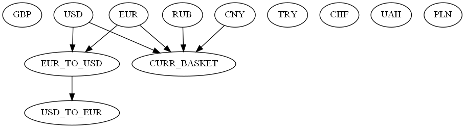

### Example of a project with tasks execution via DAG

#### Features:
- define tasks (download from external API or calculate based on downloaded) in YAML
- create, export as image, save/load, run DAG
- save into database, export as file
- command-line interface

DAG image:

See [demo notebook](demo.ipynb)
